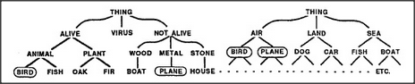

# Figure 8-9 — Two hierarchies, two purposes

**File:** `ch8/8-9.png`
**Appears in:** [../../som-8.10.md](../../som-8.10.md) — *Levels and classifications*

## What the image shows

Two small inverted trees side by side. The left tree is rooted at
**THING**, dividing into **ALIVE** and **NOT ALIVE**; ALIVE branches
into **ANIMAL** (with leaves **BIRD**, **FISH**) and **PLANT** (with
leaves **OAK**, **FIR**); NOT ALIVE branches into **WOOD** (with
leaf **BOAT**), **METAL** (with leaf **PLANE**), and **STONE** (with
leaf **HOUSE**). The right tree is also rooted at **THING**,
dividing into **AIR**, **LAND**, **SEA**, each with its own leaves —
**BIRD** and **PLANE** sit together under AIR; **DOG** and **CAR**
under LAND; **FISH** and **BOAT** under SEA.

## What it illustrates

That the same things can be sorted into entirely different
hierarchies depending on what one wants to do with the result. Birds
and aeroplanes are far apart on the biologist's tree and close
together on the hunter's. The figure is the visual support for
Minsky's argument that levels and categories belong to the use, not
to the world.
