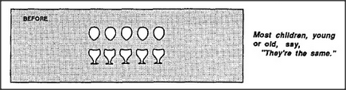

# 10 Papert's Principle

## 10.1 piaget's experiments

The psychologist Jean Piaget was one of the first to realize that
watching children might be a way to see how mind-societies grow. In
one of his classic experiments, he showed a child two matching sets
of eggs and cups — and asked, *Are there more eggs or more
egg cups?*

Then he spread the eggs apart — before the child's eyes
— and asked again if there were more eggs or more egg cups.

One might try to explain this by supposing that older children are
better at counting. However, this can't explain another famous
experiment of Piaget's, which began by showing three jars, two
filled with water. All the children agreed that the two short, wide
jars contained equal amounts of liquid. Then, before their eyes, he
poured all the liquid from one of the short jars into the tall, thin
one and asked which jar had more liquid now.

These experiments have been repeated in many ways and in many
countries — and always with the same results: each normal
child eventually acquires an adult view of quantity —
apparently without adult help! The age at which this happens may
vary, but the process itself seems so universal that one cannot help
suspecting that it reflects some fundamental aspect of the
child's development. In the next few sections we'll examine
the idea of *more* and show that it conceals the workings of
a large, complex Society-of-More — which takes many years to
learn.

---

[« Previous](som-9.4.md) | [Contents](contents.md) | [Next »](som-10.2.md)
