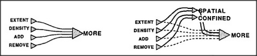
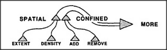
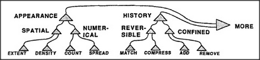

## 10.9 learning a hierarchy

How could a brain continue functioning while changing and adding new
agents and connections? One way would be to keep each old system
unchanged while building a new version in the form of a detour
around or across it — but not permitting the new version to
assume control until we're sure that it can also perform the
older system's vital functions. Then we can cut some of the
older connections.

We could use this method to form our hierarchical Society-of-More:

Now let's draw this in another form, as though there were no
room to fit new agents in between the older ones.

As we accumulate more low-level agents and additional intermediate
layers to manage them, this grows into the very multilevel hierarchy
we've seen before.

The nerve cells in an animal's brain can't always move aside
to make more room for extra ones. So those new layers might indeed
have to be located elsewhere, attached by bundles of connection
wires. Indeed, no aspect of the brain's anatomy is more
striking than its huge masses of connection bundles.

---

[« Previous](som-10.8.md) | [Contents](contents.md) | [Next »](som-11.1.md)
