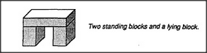
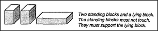
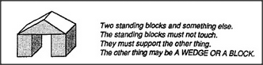

# 12 Learning Meaning

## 12.1 a block-arch scenario

Our child, playing with some blocks and a toy car, happens to build
this structure. Let's call it a Block-Arch.

Block-Arch seems to cause a strange new phenomenon: when you push
the car through it, your arm gets trapped! Then, in order to
complete that action, you must release the car — and reach
around to the other side of the arch, perhaps by changing hands. The
child becomes interested in this *Hand-Change* phenomenon and
wonders how Block-Arch causes it. Soon the child finds another
structure that seems similar — except that Hand-Change
disappears because you can't even push the car through it. Yet
both structures fit the same description!

But if Block-Arch causes Hand-Change, then this can't be a
block-arch. So the child must find some way to change the mental
description of Block-Arch so it won't apply to this. What is the
difference between them? Perhaps this is because those standing
blocks now touch one another, when they didn't touch before. We
could adapt to this by changing our description of
Block-Arch: *There must be two standing blocks and a lying
block. The standing blocks must not touch.* But even this does
not suffice, because the child soon finds yet another structure that
matches this description. Here, too, the Hand-Change phenomenon has
disappeared; now you can push the car through it without letting go!

Again we must change our description to keep this from being
considered a Block-Arch. Finally the child discovers another
variation that does produce Hand-Change:

Our child has constructed for itself a useful conception of an arch,
based entirely upon its own experience.

---

[« Previous](som-11.9.md) | [Contents](contents.md) | [Next »](som-12.2.md)
