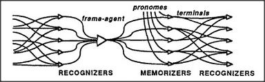
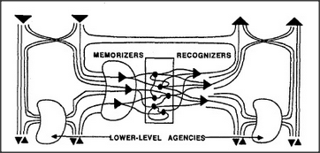

## 24.9 recognizers and memorizers

How do frames become activated? This amounts to asking how we
recognize familiar situations or things. There is no limit to how
complicated such a question can become, since there are no natural
boundary lines between recognizing, remembering, and all the rest of
how we think. For questions like this, with no place to start, we
have to construct some boundary lines from our own imagination.

We'll simply assume that every frame is activated by some set of
recognizers. We can regard a recognizer as a type of agent that, in
a sense, is the opposite of a K-line — since instead of
arousing a certain state of mind, it has to recognize when a certain
state of mind occurs. Accordingly, the recognizers of a frame are
very much like the terminals of a frame, except that the connections
to the terminals are reversed.

 

This suggests that not only frames but agencies in general might be
organized in the form of agents sandwiched between recognizers and
memorizers.

 

This sketch of how our agencies are organized is
oversimplified. Each agent, be it a frame, a K-line, or whatever,
must have some machinery for learning when it should become active
— and that may require more than simply recognizing the
presence of certain features. For example, to recognize an object
as a car, it isn't enough that it include some assortment of
parts like body, wheels, and license plate; the frame must also
recognize that those parts are in suitable relationships —
that the wheels be properly attached to the body, for
example. Workers in the field of Artificial Intelligence have
experimented with a variety of ways to make frame-recognizers, but
the field is still in its infancy. The recognizers of our
higher-level agencies might have to include mechanisms as complex as
difference-engines in order to match their relational descriptions
to actual situations.

---

[« Previous](som-24.8.md) | [Contents](contents.md) | [Next »](som-25.1.md)
