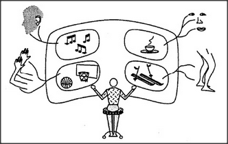

## 5.3 the remote-control self

When people have no answers to important questions, they often
give some anyway.

| | |
| --- | --- |
| What controls the brain? | The Mind. |
| What controls the mind? | The Self. |
| What controls the Self? | Itself. |

To help us think about how our minds are connected to the outer world,
our culture teaches schemes like this:

 

This diagram depicts our sensory machinery as sending information to the
brain, wherein it is projected on some inner mental movie screen. Then,
inside that ghostly theater, a lurking Self observes the scene and then
considers what to do. Finally, that Self may act — somehow
reversing all those steps — to influence the real world by sending
various signals back through yet another family of remote-control
accessories.

This concept simply doesn't work. It cannot help for you to think
that inside yourself lies someone else who does your work. This notion
of
*homunculus* — a little person inside each self —
leads only to a paradox since, then, that inner Self requires yet
another movie screen inside itself, on which to project what it has
seen! And then, to watch that play-within-a-play, we'd need yet
another Self-inside-a-Self — to do the thinking for the last. And
then this would all repeat again, as each new Self requires yet another
one to do its job!

The idea of a single, central Self doesn't explain anything. This
is because a thing with no parts provides nothing that we can use as
pieces of explanation!

Then why do we so often embrace the strange idea that what we do is done
by Someone Else — that is, our Self? Because so much of what our
minds do is hidden from the parts of us that are involved with
consciousness.

---

[« Previous](som-5.2.md) | [Contents](contents.md) | [Next »](som-5.4.md)
