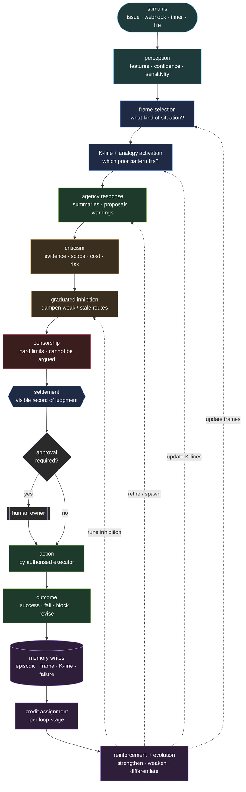

# The Cognitive Loop

Every Society of Repo follows a recurring arc from stimulus to reinforcement.

```text
stimulus
  → perception
  → frame selection
  → K-line and analogy activation
  → agency response
  → criticism
  → graduated inhibition
  → censorship
  → settlement
  → action
  → outcome
  → memory
  → credit assignment
  → reinforcement and evolution
```



The cycle is **not** purely linear: every loop closes by feeding credit back into frames, K-lines, inhibition weights, and the agency roster itself. That feedback is what turns repeated execution into learning.

---

## Stimulus

A stimulus is any event that may require a response: issue, webhook, file arrival, timer, failed run, service call, or owner request.

Every stimulus carries payload data, provenance, and a starting budget for time, model cost, critic passes, and workspace size.

---

## Perception

Perception agents extract features and produce an initial representation of the situation.

Output includes:

- classified features
- confidence per feature
- immediate unknowns
- sensitivity flags
- candidate domains for frame lookup

---

## Frame selection

Before K-lines fire, the society asks: **what kind of situation is this?**

Frames provide defaults, expected roles, likely failure conditions, linked procedures, and linked K-lines. The selected frame becomes part of every non-trivial settlement.

If no frame matches strongly, the stimulus is marked novel and the analogy pass becomes more important.

---

## K-line and analogy activation

Activation uses four inputs together:

- the classified stimulus
- the selected frame
- matching K-lines
- relational links to analogous episodes and frames

K-lines restore prior useful activation patterns.
Analogy provides fallback structural borrowing when no strong direct match exists.

The activation layer also applies:

- soft inhibition from failure memory and weak prior outcomes
- hard exclusions required by insulation rules
- attention budgets and summary-first routing

---

## Agency response

Activated agencies contribute proposals, summaries, warnings, questions, and comparisons.

Larger ecologies do not send all raw outputs directly to settlement. Intermediate assembly roles compress raw evidence into working summaries and assembly summaries first.

---

## Criticism and graduated inhibition

Critics challenge evidence quality, scope, risk, privacy, cost, staleness, and confidence.

Graduated inhibition sits between criticism and censorship:

- weak paths may be dampened rather than blocked
- repeated failure can reduce activation weights without forbidding a route
- taboo paths can be deprioritised before they require a censor

---

## Censorship

Censors enforce hard limits that cannot be argued away: cloud egress, authority violations, payment limits, credential exposure, PII exfiltration, and excessive delegation.

---

## Settlement

A settlement records:

- the governing frame
- the activated agencies and inhibitions
- proposal provenance and method
- alternatives considered
- reasoning limits and blind spots
- ideals and policies cited
- the chosen action and required approval

This is where the society's judgment becomes visible.

---

## Action and outcome

The authorised executor acts within constitutional scope.

Outcomes include success, failure, block, revision required, owner override, and unexpected side-effects.

---

## Memory

The cycle writes to the right representation classes:

- episodic records for the event
- semantic facts for durable knowledge
- procedural records for refined methods
- frame updates when situation defaults changed
- K-line updates for activation patterns
- analogy links for structural reuse
- concept candidates for recurring abstractions
- failure memory for harmful or weak routes

All durable records carry typed relational links.

---

## Credit assignment and evolution

The society separately evaluates:

- perception quality
- frame choice
- analogy choice
- K-line activation
- proposal quality
- critic usefulness
- censor correctness
- settlement choice
- execution quality
- memory write quality

Quarterly ecology review uses this evidence to reinforce, weaken, differentiate, merge, retire, or protect agencies.

---

## Loop summary

```text
stimulus → perception → frame → activation → response → criticism
         → inhibition → censorship → settlement → action → outcome
         → memory → credit assignment → reinforcement → next cycle
```



```mermaid
stateDiagram-v2
  direction LR
  [*] --> Perceiving : stimulus arrives
  Perceiving --> Framing
  Framing --> Activating
  Activating --> Responding
  Responding --> Criticising
  Criticising --> Inhibiting : weak / stale
  Criticising --> Censoring : risky
  Inhibiting --> Censoring
  Censoring --> Settling
  Settling --> AwaitingApproval : approval required
  Settling --> Acting : routine
  AwaitingApproval --> Acting : granted
  AwaitingApproval --> Cancelled : denied / timeout
  Acting --> Observing
  Observing --> Remembering
  Remembering --> Crediting
  Crediting --> Evolving
  Evolving --> [*] : reinforce / differentiate / retire
  Cancelled --> Remembering : record refusal
```

The loop does not merely act.
It learns what kind of situation it was in, what structures it used, what it still did not understand, and which part of the ecology deserves credit or blame.

---

## Source notes

- **Minsky 1986** informs the loop's framing, activation, criticism, and memory structure.
- **Minsky 1988** informs graduated inhibition, insulation, developmental protection, and hierarchy.
- **2025 Society of Minds research** informs relational memory, ecology observation, and reflective metrics.
