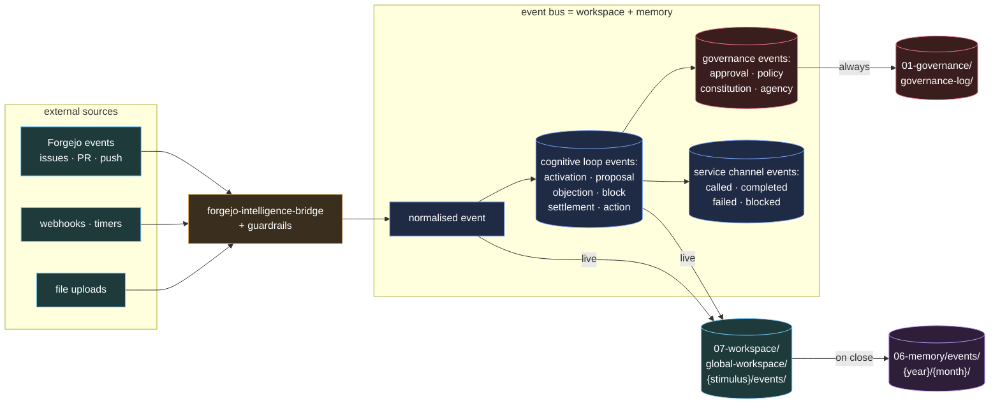

# Event Protocol

Every meaningful action in a Society of Repo emits an event.

Events are the nervous system of the society. They carry stimuli from the outside world and signal state changes between agencies.



---

## Event schema

Every event must conform to this schema:

```yaml
event:
  id:          # Unique event ID: event.{domain}.{type}.{sequence}
  type:        # Event type (see taxonomy below)
  source:      # The agency or system that emitted this event
  timestamp:   # ISO 8601 timestamp
  payload:     # Domain-specific content (see payload schema by type)
  metadata:
    sor_id:    # Which SOR this event belongs to
    stimulus:  # The originating stimulus ID, if applicable
    trace:     # Chain of event IDs that led to this event
```

---

## Event taxonomy

### Document events

| Type | Trigger |
| --- | --- |
| `document.ingested` | A document was received into the intake directory |
| `document.classified` | A document was classified by intake-bee |
| `document.routed` | A document was routed to a specialist agency |
| `document.processed` | A document was fully processed and memory updated |

### Invoice and financial events

| Type | Trigger |
| --- | --- |
| `invoice.received` | A supplier invoice arrived |
| `invoice.price-increase-detected` | Invoice price increased above threshold |
| `invoice.duplicate-detected` | A potential duplicate invoice was identified |
| `financial.anomaly-detected` | An unusual pattern in financial records was detected |

### Contract events

| Type | Trigger |
| --- | --- |
| `contract.received` | A contract document arrived |
| `contract.renewal-warning` | A contract renewal date is approaching |
| `contract.obligation-extracted` | Obligations extracted from a contract |
| `contract.risk-flagged` | A risk was identified in a contract |

### Staff and compliance events

| Type | Trigger |
| --- | --- |
| `staff.certificate-expiry-warning` | A staff certificate is approaching expiry |
| `staff.compliance-check-completed` | A compliance check was completed |
| `staff.onboarding-triggered` | A new staff onboarding process was started |

### Cognitive loop events

| Type | Trigger |
| --- | --- |
| `activation.kline-matched` | A K-line matched a stimulus and activated agencies |
| `activation.novel-stimulus` | No K-line matched; novel stimulus processing started |
| `proposal.submitted` | An agency submitted a proposal to the global workspace |
| `objection.raised` | A critic raised an objection to a proposal |
| `block.applied` | A censor blocked a proposed action |
| `settlement.formed` | A settlement was reached for a stimulus |
| `settlement.approved` | A settlement was approved (human or governance) |
| `action.executed` | An authorised action was executed |
| `action.failed` | An authorised action failed during execution |
| `memory.updated` | A memory repo was updated after an outcome |
| `kline.reinforced` | A K-line was reinforced after a successful outcome |
| `kline.weakened` | A K-line was weakened after a failed outcome |

### Forgejo runtime events

| Type | Trigger |
| --- | --- |
| `forgejo.event.received` | A Forgejo Actions or webhook payload entered the SOR runtime |
| `forgejo.event.normalized` | The bridge converted a Forgejo payload into the normalized event schema |
| `forgejo.surface.routed` | A normalized event was mapped to an active `forgejo-intelligent-*` surface |
| `forgejo.surface.rejected` | A guardrail rejected an unknown, inactive, bot-originated, oversized, or unsafe event |
| `forgejo.state.committed` | Runtime state, session mapping, or transcript changes were committed to git |
| `forgejo.api.write` | The runtime wrote to Forgejo through the platform API adapter |
| `forgejo.workflow.failed` | A Forgejo Actions run failed before completing the runtime pipeline |
| `forgejo.runtime.disabled` | The enable sentinel, workflow, token scope, or surface folder disabled runtime behavior |
| `forgejo.health.reported` | A scheduled or manual runtime health check produced a report |

### Governance events

| Type | Trigger |
| --- | --- |
| `approval.requested` | A human approval was requested |
| `approval.granted` | A human approval was granted |
| `approval.denied` | A human approval was denied |
| `policy.changed` | A policy in the policy ledger was changed |
| `constitution.changed` | A constitution was amended |
| `agency.spawned` | A new agency was created |
| `agency.retired` | An agency was retired |

### Service channel events

| Type | Trigger |
| --- | --- |
| `service.called` | An external SOR service was called |
| `service.completed` | An external SOR service call completed |
| `service.failed` | An external SOR service call failed |
| `service.blocked` | A censor blocked an external SOR service call |
| `transaction.recorded` | A service transaction was recorded |

---

## Payload schemas

### document.ingested

```yaml
payload:
  document_id: string
  document_type: string (inferred or unknown)
  source: string (upload path, email, webhook)
  size_bytes: integer
  classification_confidence: float (0–1)
```

### activation.kline-matched

```yaml
payload:
  stimulus_id: string
  kline_id: string
  activated_agencies: list of agency IDs with activation weight
  suppressed_agencies: list of agency IDs
```

### settlement.formed

```yaml
payload:
  settlement_id: string
  stimulus_id: string
  proposals: list
  objections: list
  blocks: list
  authorised_action: string
  approval_required: boolean
  cloud_allowed: boolean
  authorised_executor: agency ID
```

### forgejo.event.normalized

```yaml
payload:
  platform: forgejo
  surface: issue | pull-request | commit | action | wiki | release | unknown
  surface_folder: forgejo-intelligent-issue
  platform_event: issues
  action: opened
  actor: string
  repository: owner/repo
  title: string
  body_digest: string
  number: integer or null
  node_id: string or null
  html_url: string
  default_branch: string
  metadata: object
  raw_payload_ref: path to redacted payload or fixture
```

Raw Forgejo payloads may contain secrets or private data. If a raw payload is
stored outside transient workflow logs, it must be redacted first.

---

## Event storage

During an active cognitive cycle, events are written under the stimulus workspace:

```text
07-workspace/global-workspace/{stimulus-id}/events/{event-id}.yaml
```

When the cycle completes, events are archived to the events memory system:

```text
06-memory/events/{year}/{month}/{event-id}.yaml
```

Governance events are additionally copied to:

```text
01-governance/governance-log/{year}/{event-id}.yaml
```

This gives the society both short-term operational visibility and long-term audit retention.

---

## Event emission rules

1. Every activated agency must emit at least one event when it processes a stimulus.
2. Events must be emitted before the agency acts on a stimulus (announce intent).
3. Events must be emitted after the agency completes its action (confirm completion).
4. Events must be written to the relevant workspace or memory path as a YAML file.
5. Events must include the full trace chain (list of event IDs that led to this event).
6. Forgejo runtime events must include the Forgejo run ID, repository, actor, and surface folder when those values exist.
7. Guardrail rejections are still events. They are not agency failures unless a settlement later judges them as such.
8. API writes must reference the adapter method used, the Forgejo target URL or issue/PR number, and the authorising settlement when the write has external effect.

---

## Event retention

Events are memory. They are never deleted — operational events are archived to the events memory system and decay only in retrieval priority (see [06-memory.md](06-memory.md)).

Audit-critical events (governance, financial, legal) are retained permanently regardless of temperature.
