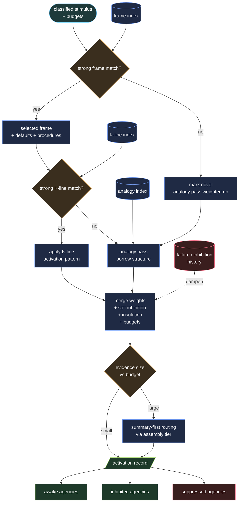

# Activation Protocol

Activation converts a stimulus into a bounded set of awake, contributing agencies.

Efficient activation is not only about speed. It is about selecting the right frame, the right K-lines, the right analogies, and the right amount of work.

---

## Activation inputs

The activation layer receives:

1. a classified stimulus
2. the frame index
3. the K-line index
4. the analogy index
5. failure and inhibition history
6. a per-stimulus budget for agencies, critic passes, model cost, wall-clock time, and workspace size
7. Forgejo runtime context when the stimulus came from Forgejo: event name, action, actor, repository, surface folder, workflow run, and fork/public status

---

## Forgejo surface activation

Forgejo surface activation is the operational gate before SOR agency activation.

A Forgejo event may wake the society only when:

1. the `.forgejo/workflows/` trigger receives the event
2. `.forgejo-intelligence/forgejo-intelligence-ENABLED.md` exists
3. the event bridge maps the payload to a known surface
4. the matching `forgejo-intelligent-*` folder exists
5. the guardrail accepts the event
6. the target agency, critic, censor, or service has a constitution and rights entry

Folder presence is a runtime permission, not full cognitive authority. A
surface folder can route a stimulus into the society; it cannot bypass
constitutions, censors, settlements, or approval gates.

Removing a surface folder is operational inhibition. Adding or restoring a
surface folder is a governed activation change.

---

## Activation algorithm

```text
1. Receive classified stimulus features and initial confidence values.
2. Query frame index for matching frames.
3. Select the best frame, or mark the stimulus novel if no frame is strong enough.
4. Query K-lines linked to the chosen frame and any globally relevant K-lines.
5. Apply direct K-line matches.
6. If no strong K-line match exists, run an analogy pass across prior episodes and frames.
7. Merge activation weights, soft inhibition weights, insulation constraints, and budget limits.
8. Route low-level evidence through summary tiers before settlement when scale requires it.
9. Emit the activation record into the workspace.
```



---

## Frames before K-lines

A K-line answers: **which pattern worked before?**

A frame answers: **what kind of situation is this?**

Frame selection happens before K-line activation so that defaults, expected roles, linked procedures, and likely failure modes can shape the rest of deliberation.

---

## Analogy fallback

When direct K-line matches are weak:

- search for structurally similar frames or episodes
- record why the analogy was chosen
- record confidence in the analogy and what may not transfer cleanly
- dampen analogy-driven activations if the analogy is thin or cross-domain uncertainty is high

Novel stimuli should borrow structure before they default to exhaustive, unbounded deliberation.

---

## Graduated inhibition

Activation is not only wake-or-suppress.

Soft inhibition may come from:

- failure memory
- stale K-lines
- recent false positives
- repeated critic objections

These signals can reduce weight without fully blocking a path.

Hard censors remain separate and act later.

---

## Resource and attention economy

Every activation record carries a budget:

```yaml
budgets:
  max_agencies: 6
  max_critic_passes: 4
  max_model_cost: local-only
  max_wall_clock_seconds: 180
  max_workspace_items: 20
```

Summary-first routing is the default under congestion. Escalation to raw evidence must be justified by uncertainty, dispute, or impact.

---

## Activation record

```yaml
activation_record:
  stimulus_id: evt-001
  timestamp: 2026-05-07T09:15:00Z
  frame_selected: frame.supplier-price-review
  frame_confidence: 0.89
  analogy_used:
    analogy_id: analogy.invoice-spike-to-subscription-spike
    confidence: 0.42
  budgets:
    max_agencies: 6
    max_critic_passes: 4
    max_workspace_items: 20
  activated:
    - agency: agency.supplier-bee
      weight: 0.95
    - agency: agency.finance-watch
      weight: 0.84
  inhibited:
    - agency: agency.contract-bee
      weight_delta: -0.20
      reason: repeated false positives on price-only events
  suppressed:
    - agency: agency.staff-bee
      reason: frame excludes staff workflows
  forgejo_context:
    platform_event: issues
    action: opened
    actor: eric
    repository: owner/repo
    surface_folder: forgejo-intelligent-issue
    workflow_run_id: "12345"
```

---

## Source notes

- **Minsky 1986** supplies frames, K-lines, and hierarchy pressure.
- **Minsky 1988** sharpens the importance of inhibition and protected differentiation.
- **2025 Society of Minds research** motivates the explicit budget and relational-analogy treatment.
