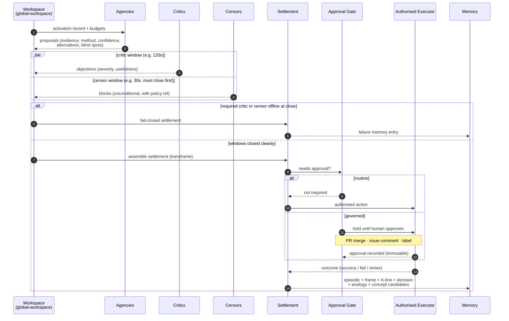

# Settlement Protocol

A settlement is a visible record of how a decision formed in the society.

No non-trivial action may occur without a settlement.



---

## What a settlement records

A settlement records:

- the stimulus that triggered the process
- the governing frame and any analogies used
- the agencies that woke and any routes that were inhibited
- what each agency proposed
- the evidence, method, confidence, and alternatives behind each proposal
- the unknowns, blind spots, and observability limits still present
- what critics objected to and what censors blocked
- which ideals, procedures, and prior decisions shaped the outcome
- what action was authorised and how memory should be updated

---

## Settlement schema

```yaml
settlement_id:          # settlement.{domain}.{year}-{sequence}
stimulus:               # originating event or issue ID
stimulus_type:          # event taxonomy value
timestamp:              # ISO 8601 when settlement formed
governing_frame: frame-id
analogies_used:
  - analogy-id

activated:
  - agency: agency-id
    weight: float
inhibited:
  - agency: agency-id
    weight_delta: float
    reason: text

proposals:
  - from: agency-id
    proposal: |
      Human-readable description of the proposed action.
    evidence:
      - citation or record reference
    method: retrieval | rule | local-model | hybrid
    confidence: float
    alternatives_considered:
      - text
    observability_limits:
      - text
    opaque_model_dependencies:
      - text
    cited_procedures:
      - procedure-id
    cited_decisions:
      - settlement-id
    cited_ideals:
      - ideal-id
    introspection:
      unknowns:
        - text
      blind_spots:
        - text
      explanation_quality: low | medium | high

objections:
  - from: critic-id
    objection: |
      Human-readable objection.
    proposal_targeted: agency-id
    severity: low | medium | high
    usefulness_score: float

blocks:
  - from: censor-id
    block: |
      What was blocked.
    reason: policy-id or rule reference
    unconditional: true

settlement:
  action: |
    What will happen.
  approval_required: true | false
  approval_type: null | category-id
  cloud_allowed: true | false
  authorised_executor: agency-id
  summary_tier: settlement-summary | executive-briefing
  forgejo_execution:
    surface: issue | pull-request | action | release | wiki | none
    target: issue-or-pr-number-url-or-path
    api_method: createIssueComment | editIssue | createPullRequest | createRelease | updateWikiPage | none
    workflow_run_id: string or null
    commit_sha: string or null

resource_budget:
  max_agencies: int
  max_critic_passes: int
  max_wall_clock_seconds: int
  max_workspace_items: int
resource_usage:
  agencies_used: int
  critic_passes_used: int
  wall_clock_seconds: int
  workspace_items_used: int

dialogical_metrics:
  diversity_of_proposal_sources: float
  disagreement_resolution_quality: float
  unnecessary_deliberation_rate: float

memory_updates:
  episodic: true | false
  semantic: []
  frame_update: no_change | reinforce_defaults | propose_new_frame
  kline_update: reinforce_metadata | weaken_metadata | propose_structural_change
  analogy_update: no_change | reinforce | propose_new_analogy
  concept_candidates: []
  failure: true | false
```

---

## Major proposal rule

Major proposals must cite the frame, procedures, prior decisions, and ideals used. They must also record what the society still does not know.

A society cannot truly criticise what it cannot inspect.

---

## Settlement is a transframe

A settlement IS a transframe (`02-protocols/09-representation.md`): it describes a *change* with explicit slots — the actor (the agencies), the action (the chosen path), the object (the stimulus and its target), the before-state (perception and frame), the after-state (the authorised outcome), the instrument (the executor), and the cause (cited evidence, ideals, decisions).

This is not a metaphor. The settlement schema above is a transframe schema. New settlement *kinds* are new transframe specialisations and must declare which slots they extend or constrain.

---

## Suppressor stage

Settlements record blocks from censors *and* catches from suppressors. The two are kept distinct because they sit at different points in the loop (see [05-censors/README.md](../05-censors/README.md)):

```yaml
suppressor_catches:
  - from: suppressor-id
    candidate_output: |
      Redacted candidate output that was caught at the boundary.
    boundary: forgejo-write | payment-call | egress | low-trust-surface
    upstream_censor_that_should_have_caught: censor-id | none
    learning_proposal: text
    severity: low | medium | high
```

A suppressor catch in a settlement is not just a block; it is a *learning event* that names which censor or rule should have prevented the path earlier.

---

## Runtime semantics

Settlement is a runtime contract, not only a schema. The protocol pins down what happens under the operational realities a long-running society actually faces.

### Critic and censor windows

```yaml
runtime:
  critic_window_seconds: 120        # how long critics have to register objections
  censor_window_seconds: 30         # how long censors have to register blocks (must be < critic window)
  required_critics:                 # critics whose absence fails the settlement closed
    - evidence-critic
    - risk-critic
  required_censors:                 # censors whose absence fails the settlement closed
    - cloud-egress-censor
    - authority-censor
    - credential-censor
  optional_critics:                 # critics whose absence is logged but does not fail closed
    - source-quality-critic
    - staleness-critic
```

### Failure modes

| Situation | Defined behaviour |
| --- | --- |
| A required critic is offline at window close | Settlement **fails closed**: no action authorised. Failure memory entry created. The B-brain layer is alerted. |
| A required censor is offline at window close | Settlement **fails closed unconditionally**. There is no override path. |
| An optional critic is offline | Settlement may proceed; the missing critic is recorded in `objections` as `unavailable` with a `recheck_required` flag. |
| Two critics produce contradictory verdicts | Escalation under the Non-Compromise Principle (P3). The settlement records both verdicts and routes to a higher-rank decider; no implicit blending. |
| Settlement budget (`max_wall_clock_seconds`, `max_critic_passes`) exhausted | Settlement closes with `outcome: budget_exhausted`. Action is *not* authorised by default; budget exhaustion is a learning signal, not a soft pass. |
| Authorised executor not available | Settlement enters `awaiting-executor` for at most one further critic window, then fails closed. |
| Owner approval required and not granted within the approval window | Settlement closes `outcome: approval_timeout`. The proposal is preserved; re-running requires a new settlement. |

### Retry policy

A failed-closed settlement is *never* automatically retried. Re-attempting the same stimulus class is itself a settlement-grade decision and must cite the original settlement's failure record.

This rule prevents the most common drift pattern in multi-agent systems: silent retry until success, which destroys the failure-memory signal.

### Idempotency

Settlements carry a `stimulus` ID. The orchestrator MUST treat that ID as the idempotency key. A second settlement on the same stimulus while the first is open is forbidden; the second attempt joins the first as an additional input.

---

## Example settlement

```yaml
settlement_id: settlement.supplier-invoice.2026-001
stimulus: event.invoice.price-increase-detected.evt-042
stimulus_type: invoice.price-increase-detected
timestamp: 2026-05-07T09:15:42Z
governing_frame: frame.supplier-price-review
analogies_used: []

activated:
  - agency: agency.supplier-bee
    weight: 0.95
  - agency: agency.finance-watch
    weight: 0.84
inhibited:
  - agency: agency.contract-bee
    weight_delta: -0.20
    reason: contract review is usually noise for simple price spikes

proposals:
  - from: agency.finance-watch
    proposal: Compare the new price against the last 12 months and prepare a summary.
    evidence:
      - semantic.suppliers.supplier-x-history
      - episodic.2026.05.evt-042
    method: retrieval
    confidence: 0.87
    alternatives_considered:
      - Immediate owner escalation without comparison
    observability_limits:
      - No competitor quote yet available
    opaque_model_dependencies: []
    cited_procedures:
      - procedure.supplier.price-review
    cited_decisions:
      - settlement.supplier-invoice.2025-011
    cited_ideals:
      - evidence-before-confidence
    introspection:
      unknowns:
        - Whether the increase reflects a temporary surcharge
      blind_spots:
        - No live market quote
      explanation_quality: high
```

---

## Source notes

- **D5 — Settlement is the universal decision construct.** This
  protocol carries all decision flavours (critic verdicts, censor
  firings, frame default demotions, agency differentiations,
  self-ideal revisions) under one substrate, with kinds preserving
  the distinctions. See
  [`../../THE-SOCIETY-OF-MIND/12-crosswalk-to-society-of-repo.md`](../../THE-SOCIETY-OF-MIND/12-crosswalk-to-society-of-repo.md).
- **P3 — Non-Compromise Principle.** Contradictory verdicts escalate;
  implicit blending is a protocol violation. Stated in
  [`../../THE-SOCIETY-OF-MIND/03-principles.md`](../../THE-SOCIETY-OF-MIND/03-principles.md);
  source text in
  [`../../THE-SOCIETY-OF-MIND/book/som-3.2.md`](../../THE-SOCIETY-OF-MIND/book/som-3.2.md).
- **D3 — Pronomes are settlement-scoped.** A pronome is bound when a
  settlement opens and dissolved when it closes; long-running
  attentional structures use frames, not pronomes.
- **"Settlement is a transframe."** Structural shape after Minsky's
  transframe in [`../../THE-SOCIETY-OF-MIND/book/som-21.3.md`](../../THE-SOCIETY-OF-MIND/book/som-21.3.md)
  (actor, action, object, before-state, after-state, instrument,
  cause).
- **2025 Society of Minds research** motivates the introspection
  fields, provenance depth, and dialogical metrics; see
  [`../../THE-SOCIETY-OF-MIND/research/2025-10-01.md`](../../THE-SOCIETY-OF-MIND/research/2025-10-01.md).
