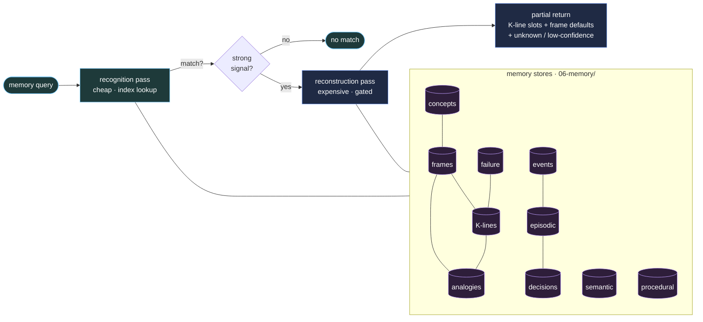
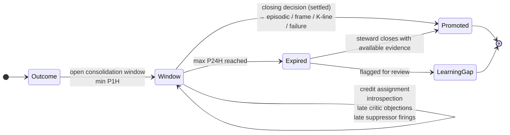

# Memory Protocol

Memory in a Society of Repo is a first-class system.

Memory is versioned, inspectable, correctable, and reviewable because it lives in Git repos.



---

## Memory types

| Type | What it holds | Where it lives |
| --- | --- | --- |
| Events | Event records and audit traces | `06-memory/events/` |
| Episodic | Specific event histories | `06-memory/episodic/` |
| Semantic | Durable general facts | `06-memory/semantic/` |
| Procedural | How to do things | `06-memory/procedural/` |
| Failure | What went wrong and why | `06-memory/failure/` |
| Frames | Situation models with defaults | `06-memory/frames/` |
| Analogies | Cross-domain structural mappings | `06-memory/analogies/` |
| Concepts | Candidate intermediate abstractions | `06-memory/concepts/` |
| K-lines | Remembered activation and inhibition patterns | `06-memory/klines/` |
| Decisions | Archived settlement records | `06-memory/decisions/` |

---

## Universal durable fields

Every long-lived record declares:

```yaml
representation_class: episodic | semantic | procedural | failure | frame | analogy | concept-candidate | kline | decision | self-ideal
status: active | probation | superseded | retired | archived
links:
  - type: supports | contradicts | caused-by | specialized-from | analogous-to | supersedes | activated-by | derived-from
    target: artifact-id
```

Representation class is mandatory for every new long-lived artifact.

---

## Memory temperature

Every memory record has a temperature:

- `hot`
- `warm`
- `cold`
- `archived`

Temperature affects routing priority but does not replace representation or link semantics.

---

## Additional record classes

### Frames

Store expected roles, default assumptions, failure conditions, linked procedures, linked K-lines, and linked analogies.

### Analogies

Store structural similarity claims between domains, with transfer notes and confidence.

### Concept candidates

Store proposed abstractions, examples, non-examples, predicted use, and governance disposition.

---

## Retrieval

Memory is read by:

1. frame selection
2. K-line activation
3. analogy lookup
4. direct agency query
5. relational traversal across typed links

Retrieval should prefer the smallest summary tier adequate for the task.

---

## Recognition vs reconstruction

Following Minsky 1986, memory in SOR exposes **two distinct query operations**, and any consumer of memory must choose between them:

| Operation | Question answered | Cost | Failure mode |
| --- | --- | --- | --- |
| **Recognition** | "Have I seen this kind of thing before, and how strongly?" | Cheap (index lookup, similarity score) | Returns nothing if the exact key is unknown |
| **Reconstruction** | "Re-evoke the agencies, frame, K-lines, and ideals that were active when this kind of thing was handled." | Expensive (loads frame, replays activation, traverses links) | Returns a plausible but inexact partial state |

Reconstruction is *gated by recognition*. The memory protocol forbids triggering a full reconstruction without first running a recognition pass that justifies the cost. This two-step gate keeps the activation budget honest.

---

## Partial returns and time-blinks

Memory queries may, and often must, return *partial* records. A reconstruction may legitimately come back with:

- some slots filled from the K-line,
- some slots filled by frame defaults,
- some slots explicitly marked `unknown` (a Minsky time-blink),
- some slots flagged as `low-confidence` or `reconstructed-not-recalled`.

A memory subsystem that returns "no match" because some slot is missing is weaker than one that returns the partial reconstruction with the missing slot named. Consumers MUST handle partial returns; they may not assume completeness.

---

## Consolidation window

> **Minsky 1988:** "It takes a long time — typically of the order of an hour — for the records of that experience to become firmly lodged in what psychologists call long-term memory."

Memory promotion is a *settled act*, not a write-through. Between an outcome and its durable memory write, SOR maintains a **consolidation window**:

```yaml
consolidation_window:
  opens_at: outcome_timestamp
  minimum_duration: P1H        # at least one hour by default
  maximum_duration: P24H       # promotion must occur within a day or be re-justified
  required_inputs_before_close:
    - credit_assignment_record
    - introspection_record
    - any_late_critic_objections
    - any_late_suppressor_firings
  closing_decision: settled    # closing the window IS the promotion decision
```

The slowness of the window is *useful* (Cache-Transfer Principle, P13). It is the gap during which credit is assigned across the loop, late signals can arrive, and structural patterns become visible. Promoting too eagerly destroys the consolidation benefit; promoting too slowly loses the experience.

A stimulus whose consolidation window expires without a closing decision is auto-flagged for the `memory-steward` and either promoted with the available evidence or recorded as a learning gap.



---

## Forgetting and decay

Forgetting is governed, not accidental.

| Memory class | Decay signal | Effect |
| --- | --- | --- |
| **K-lines** | Reinforcement count not increasing for N review cycles; weakening count rising | Temperature drops `hot → warm → cold`; below threshold the K-line is `probation` |
| **Frame defaults** | Exception count exceeds default-hit count over a defined window | Steward review opened to consider default demotion |
| **Censors** | Zero firings across two quarterly cycles AND no observed near-miss recorded by suppressors | Censor reviewed for staleness; not auto-removed (irreversible-action risk remains) |
| **Episodic** | Age plus absence of `referenced-by` links | Cold or archived; never silently deleted |
| **Failure memory** | Never decays automatically — only superseded by an explicit "this failure mode is no longer applicable" settlement | Permanent unless governance revokes |

A memory system that *cannot* forget is no better than one that cannot remember. Both lose the structure that makes memory useful. But forgetting that erases failure memory or active censors silently is itself a failure mode and is forbidden.

---

## Forgejo runtime state

`.forgejo-intelligence/state/` is operational state, not automatically durable
SOR memory.

Runtime session mappings, JSONL transcripts, health reports, and migration
records may be promoted into SOR memory only after representation review:

| Runtime artifact | Promotion target |
| --- | --- |
| Redacted event payload or workflow log excerpt | events or failure memory |
| Conversation summary | episodic memory |
| Accepted operating procedure | procedural memory |
| Accepted decision or approval | decisions memory |
| Repeated activation/inhibition pattern | K-line memory |
| Recurrent runner, token, API, or bridge fault | failure memory |

Secrets, tokens, provider keys, authorization headers, passwords, and raw
sensitive payloads are never memory artifacts.

---

## Correction, conflict, and retirement

Durable records may be corrected when they are factually wrong, superseded, duplicated, or misrepresented.

The representation protocol determines whether to:

- correct in place with preserved history
- supersede with a new artifact
- merge duplicates
- retire obsolete artifacts

---

## Source notes

- **D4 — Memory is multiple distinct kinds.** Minsky's memory is
  conceptually unified but practically scattered; SOR makes the
  kinds explicit and separate (K-line, frame, episodic, semantic,
  procedural, failure, analogy, concept, event, decision). Each kind
  has its own access pattern, TTL, and promotion rule. See
  [`../../THE-SOCIETY-OF-MIND/12-crosswalk-to-society-of-repo.md`](../../THE-SOCIETY-OF-MIND/12-crosswalk-to-society-of-repo.md).
- **Recognition vs reconstruction** follows Minsky 1986. Reconstruction
  is gated by recognition; see
  [`../../THE-SOCIETY-OF-MIND/book/som-15.10.md`](../../THE-SOCIETY-OF-MIND/book/som-15.10.md)
  and
  [`../../THE-SOCIETY-OF-MIND/book/som-19.8.md`](../../THE-SOCIETY-OF-MIND/book/som-19.8.md).
- **K-lines.** First proposed in Minsky 1980 and developed in the
  book; see
  [`../../THE-SOCIETY-OF-MIND/book/som-8.1.md`](../../THE-SOCIETY-OF-MIND/book/som-8.1.md).
  Recorded *activation pattern*, not stored content.
- **Cache-Transfer Principle.** The consolidation window is
  deliberately slow; promotion is a settled decision, not
  write-through. Quotation source:
  [`../../THE-SOCIETY-OF-MIND/research/1988.md`](../../THE-SOCIETY-OF-MIND/research/1988.md).
  Stated in
  [`../../THE-SOCIETY-OF-MIND/03-principles.md`](../../THE-SOCIETY-OF-MIND/03-principles.md).
- **Time-blinks and partial returns** follow Minsky 1986; partial
  reconstruction with marked unknowns is first-class.
- **2025 Society of Minds research** motivates relational memory and
  concept-level abstraction tracking.
