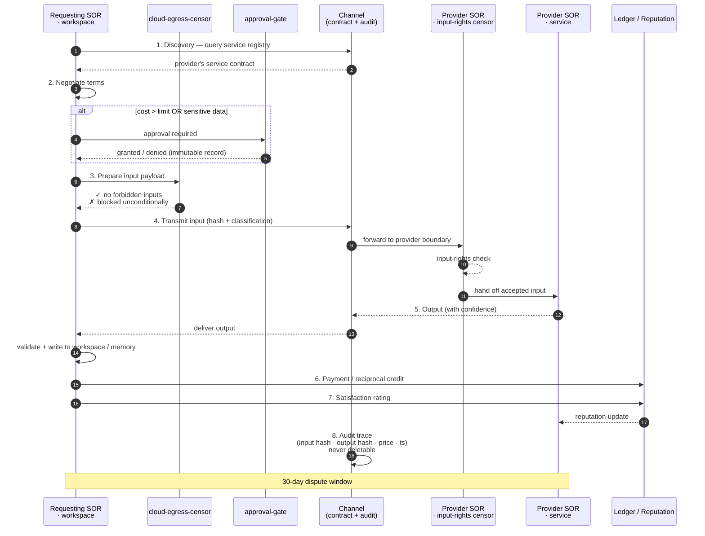

# Service Channel Protocol

A Society of Repo may call services provided by other societies, and may expose services to other societies.

A Society Channel is a governed repo-to-repo service relationship.



---

## What a Society Channel is

A Society Channel is not just an API call.

It is a **governed cognitive transaction** between two societies, with:

```text
service contract
input rights
output rights
pricing or reciprocal credits
privacy terms
retention terms
audit trace
confidence score
dispute window
reputation update
```

Both sides of the channel must agree to these terms before any transaction occurs.

---

## Transaction lifecycle

```text
1. Discovery
   The requesting SOR identifies a needed capability.
   It queries the service registry for a provider SOR offering that capability.

2. Contract negotiation
   The requesting SOR reads the provider's service contract.
   If terms are acceptable, the requesting SOR issues a transaction request.
   If terms require human approval (cost above limit, sensitive data involved),
   the approval gate is triggered.

3. Input preparation
   The requesting SOR assembles the permitted input payload.
   The cloud-egress-censor verifies the payload against the service contract's
   forbidden input list before transmission.

4. Execution
   The requesting SOR sends the input to the provider SOR's service endpoint.
   The provider SOR processes the request and returns the output.

5. Output receipt
   The requesting SOR receives and validates the output.
   The output is written to the appropriate workspace or memory repo.

6. Payment or credit
   The agreed transaction price is recorded.
   Credits are debited from the requesting SOR's account.
   Or a reciprocal credit is recorded if a barter agreement is active.

7. Evaluation
   The requesting SOR records a satisfaction score.
   The provider SOR's reputation metrics are updated.

8. Audit trace
   Both sides record the full transaction: input classification, output hash, price, timestamp.
   The transaction is never deletable from audit history.
```

---

## Transaction schema

```yaml
transaction_id:     # tx.{year}.{sequence}
requesting_sor:     # sor.{name}
providing_sor:      # sor.{name}
service_id:         # service.{name}.v{N}
timestamp:          # ISO 8601

input:
  classification:   # data categories present in the input
  cloud_egress_cleared: true | false
  censor_verified: true | false
  payload_hash:     # SHA-256 of the input payload (for audit; not the payload itself)

output:
  received: true | false
  output_hash:      # SHA-256 of the output
  confidence:       # float (0–1), provider-supplied confidence score

payment:
  mode:             # currency | credits | reciprocal
  amount:           float
  currency:         # ISO 4217 or "credits"
  status:           # pending | completed | disputed

evaluation:
  requesting_sor_rating:  # 1–5
  notes:            # optional plain text

dispute:
  window_days:      30
  dispute_filed:    false
  resolution:       null
```

---

## Input rights and forbidden inputs

Every service contract declares:

```yaml
inputs:
  accepted:
    - document_type (e.g., contract_pdf)
    - context fields (e.g., supplier_name)
  forbidden:
    - raw patient data
    - bank credentials
    - tax file numbers
    - full employee records
```

The cloud-egress-censor validates every outbound payload against the forbidden input list before transmission.

A payload containing forbidden inputs is **blocked unconditionally**, regardless of the service's value.

---

## Output rights

Every service contract declares what the provider may and may not retain:

```yaml
rights:
  buyer_receives:
    - output artefacts
    - audit trace
    - correction rights
  provider_may_retain:
    - anonymised performance metrics
  provider_may_not_retain:
    - raw input content
    - identifiable data
```

Violations of output rights are a dispute trigger.

---

## Reciprocal agreements

SORs may barter services instead of paying currency.

```yaml
reciprocal_agreement:
  id: recip.{party-a}.{party-b}.{year}-{sequence}
  parties:
    - sor.forgejo-society
    - sor.dental-compliance

  grant:
    sor.forgejo-society_receives:
      service: service.dental-compliance-check.v1
      credits: 100

    sor.dental-compliance_receives:
      service: service.contract-obligation-extraction.v1
      credits: 100

  rules:
    transferable: false
    expires: 2026-12-31
    revocable_for_policy_breach: true
    audit_required: true
```

---

## Service registry

This SOR's published services are documented in [../08-services/](../08-services/).

External services this SOR consumes are registered in [../09-channels/](../09-channels/).
