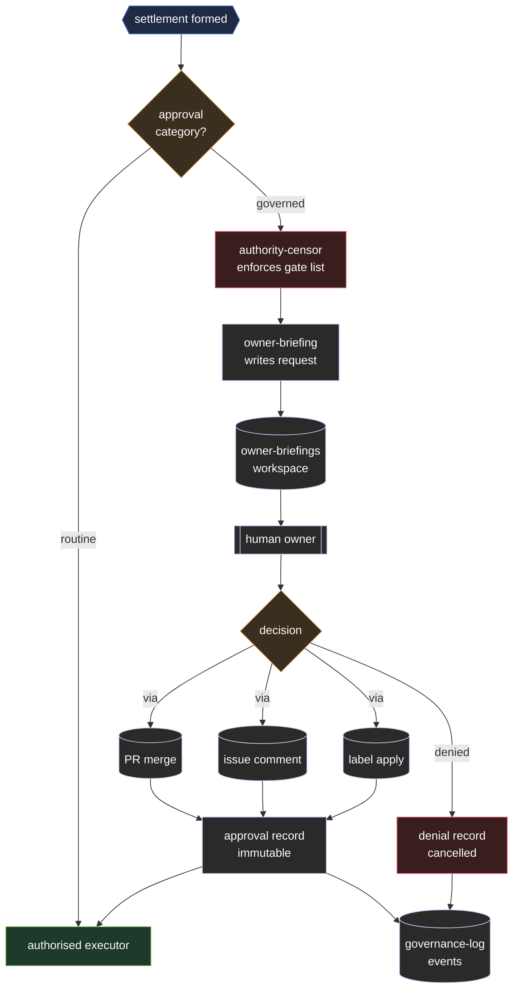

# Governance Protocol

The governance protocol defines which actions always require human approval and how that approval is recorded.

---

## The principle

Governance is not bureaucracy.

Governance is the mechanism that keeps the society aligned with the owner's intent, limits, and values.

Without governance, a useful agency becomes a rogue assistant.

---

## Actions that always require approval

The following categories always require human approval, regardless of any agency's authority level.

The authority-censor enforces this list unconditionally. No settlement may authorise these actions without a recorded human approval event.

```text
constitutional_change
authority_level_increase
policy_change
payment_above_limit
service_contract_above_limit
cloud_egress_sensitive
external_disclosure
legal_commitment
clinical_decision
employment_decision
agency_spawn
agency_retirement
external_service_registration
runtime_enablement_change
surface_activation_change
token_scope_change
workflow_trigger_expansion
```

For the full definitions of each category, see [../01-governance/approval-gate.md](../01-governance/approval-gate.md).

---

## How approval is requested

When a settlement requires human approval:

1. The settlement enters `pending_approval` state.
2. The `owner-briefing` agency writes a request to the owner-briefings workspace.
3. The request includes:
   - The settlement ID
   - The approval category triggered
   - A plain-language summary of what is being proposed and why
   - The evidence cited
   - What happens if the owner approves vs. denies
4. No further action is taken until the owner responds.



---

## How approval is granted

| Method | When used | How to grant |
| --- | --- | --- |
| PR merge | Constitutional changes, policy changes, agency lifecycle | Owner merges the PR |
| Issue comment | Financial, data egress, legal commitments | Owner writes a specific confirmation comment |
| Label application | Routine approvals | Owner applies the `approved` label |

All approval methods produce a traceable event in version control.

---

## Approval record

When approval is granted, the settlement is updated:

```yaml
approval:
  granted_by: owner
  method: issue_comment
  timestamp: 2026-05-07T10:30:00Z
  reference: https://forgejo.local/forgejo-society/forgejo-society/issues/42#comment-7
```

This record is permanent and cannot be modified after writing.

---

## Denial record

When an owner denies an approval request:

```yaml
denial:
  denied_by: owner
  method: issue_comment
  timestamp: 2026-05-07T10:35:00Z
  reason: "Cost is too high. Seek alternative supplier first."
  settlement_state: cancelled
```

The settlement moves to `cancelled` state. Denial reasons inform future K-line updates.

---

## Governance events

Every governance action emits a governance event (see [03-events.md](03-events.md)):

```text
approval.requested
approval.granted
approval.denied
policy.changed
constitution.changed
agency.spawned
agency.retired
```

These events are written to [../01-governance/governance-log/](../01-governance/governance-log/README.md).

---

## Forgejo operations governance

Forgejo can execute write-capable automation. Runtime changes that widen that
automation are governance changes, even when they are implemented as ordinary
file edits.

The following require a settlement or governance PR before execution:

| Runtime change | Governance reason |
| --- | --- |
| Restoring `.forgejo-intelligence/forgejo-intelligence-ENABLED.md` | Re-enables all eligible automation |
| Adding or restoring a `forgejo-intelligent-*` folder | Enables a new event surface |
| Expanding `.forgejo/workflows/` triggers or loosening job conditions | Allows more stimuli to reach agents |
| Allowing fork PR workflows to receive write tokens or model secrets | Expands untrusted-code exposure |
| Increasing `FORGEJO_TOKEN` or PAT scope | Expands infrastructure authority |
| Adding a new model provider secret | Expands model and data-egress capability |

Emergency disablement is allowed without prior approval when it narrows
automation: remove the enable sentinel, remove a surface folder, reduce token
scope, or disable the workflow. The action must still emit a governance or
Forgejo runtime event and be reviewed afterward.

---

## Constitutional anchors

No governance protocol rule may be modified to remove the human approval requirement for the categories listed in the approval-gate.

The constitutional anchors are:

1. Humans are not a failure mode. They are the authority that keeps the society aligned.
2. No agency may grant itself authority.
3. No automation may waive a governance requirement.
4. Every important decision produces a traceable record.

These anchors are the non-negotiable limits of the constitution.
