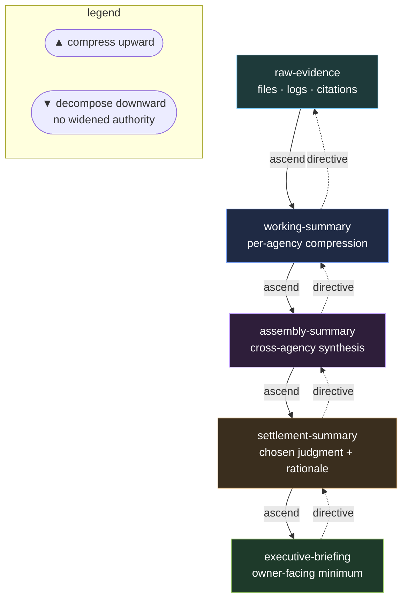

# Hierarchy and Summaries Protocol

Large societies do not scale by showing every raw proposal to every decider.

They scale by compressing upward and decomposing downward.

Escalation downward (to a lower tier) must be justified by uncertainty, disagreement, or risk. Decomposition downward may never widen authority beyond the parent settlement.

---

## Summary tiers

| Tier | Purpose |
| --- | --- |
| `raw-evidence` | Source files, logs, direct citations |
| `working-summary` | Local agency compression of raw evidence |
| `assembly-summary` | Cross-agency synthesis before settlement |
| `settlement-summary` | Chosen judgment and rationale |
| `executive-briefing` | Owner-facing summary with only necessary detail |

Escalation to a lower tier must be justified by uncertainty, disagreement, or risk.

---

## Ascending hierarchy

Worker agencies produce working summaries.
Assembly roles combine them into assembly summaries.
Settlement produces the society's judged result.
Owner-briefing compresses that result for human review.

---

## Descending hierarchy

High-level settlements may be decomposed into narrower directives.

A descending directive records:

- parent settlement
- delegated scope
- authority boundary
- allowed outputs
- completion signal

No directive may widen authority beyond the parent settlement.

---

## Source notes

This protocol realises two of Minsky's growth principles directly:

- **P2 — Papert's Principle.** New competence often comes not from
  better workers but from new *administrative* agencies that summarise
  and manage existing ones. The summary tiers above are the
  administrative layer that lets a large society scale without showing
  every raw proposal to every decider. Stated in
  [`../../THE-SOCIETY-OF-MIND/03-principles.md`](../../THE-SOCIETY-OF-MIND/03-principles.md);
  source text in
  [`../../THE-SOCIETY-OF-MIND/book/som-10.4.md`](../../THE-SOCIETY-OF-MIND/book/som-10.4.md).
- **Hierarchy Asymmetry.** Assembly roles and working roles are
  *exclusive* — one agency cannot do both. A working agency that
  also summarises itself contaminates its own audit signal.

The descending-hierarchy rule (no widened authority below a parent
settlement) is the safety counterpart: the administrative layer
delegates *scope*, never *authority beyond the parent*. This keeps
P2's benefits without letting an assembly tier silently grant itself
more power than the settlement that called it.
