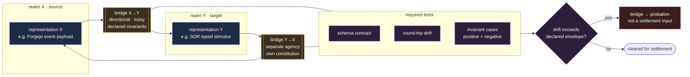

# Bridges Protocol

Different agencies use different internal representations. They cannot directly share state. What they share are **bridges**: small, specialised translator agencies whose only job is to convert a representation in realm X into a (necessarily approximate) representation in realm Y.

> **Minsky:** Bridges are lossy, directional, learned, and a frequent point of silent failure when two realms drift apart.

This protocol makes bridge agencies a first-class kind in SOR, with declared properties and explicit testability requirements.



A bridge that hides inside another agency hides the lossy step from review. Bridges are agencies — with constitutions, authority levels, memory footprints, and credit-assignment records — never anonymous utility code.

---

## When a bridge is required

A bridge agency must be created (and not buried inside another agency) whenever:

1. Two agencies, critics, censors, services, or surfaces consume or produce different representation classes (`microneme`, `polyneme`, `frame`, `transframe`, `kline`, etc.).
2. A Forgejo runtime event must become an SOR-typed stimulus (the canonical example: the `forgejo-intelligence-bridge`).
3. A service channel converts an outbound effect into another society's vocabulary.
4. A retrieval system ingests external corpora into a frame or semantic memory.

If a worker agency is silently doing translation, the translation has been hidden from review. That is a structural defect, not a convenience.

---

## Bridge contract

Every bridge agency declares, in its constitution:

```yaml
bridge:
  source_realm: realm-id          # what the bridge consumes
  target_realm: realm-id          # what the bridge produces
  direction: source_to_target     # bridges are directional; round trips are separate bridges
  lossiness:
    - field: source-field
      loss_kind: dropped | summarised | typed-coercion | quantised
      reason: text
  invariants_preserved:
    - text                        # what the bridge guarantees survives translation
  invariants_known_to_break:
    - text                        # what the bridge knowingly cannot preserve
  fallback_on_failure: drop | escalate | shadow_copy_to_failure_memory
  round_trip_partner: bridge-id | none
```

Bridges are *single-direction*. A bridge from vision to language is not the same agency as a bridge from language to vision. If both directions are needed, two bridge agencies exist with their own constitutions.

---

## Required tests

Every bridge ships with at least three categories of tests:

1. **Schema contract test.** The output is well-formed in the target realm.
2. **Round-trip drift test.** When a `round_trip_partner` exists, sample inputs are translated source → target → source and the diff is bounded by declared `lossiness`.
3. **Invariant test.** Each declared `invariants_preserved` entry has at least one positive and one negative test case.

A bridge without round-trip drift tests may not carry stimuli into settlement.

---

## Bridge drift detection

Bridges silently produce nonsense when the source or target realm changes underneath them. Detection requires that the ecology actively look for it:

- The `representation-steward` runs a quarterly review of every active bridge's drift-test results.
- The `memory-steward` flags downstream artifacts whose provenance trail crosses a bridge whose tests have regressed.
- A bridge whose drift exceeds its declared envelope is marked `probation` and may not be a settlement input until repaired.

---

## Bridges are agencies, not utilities

A bridge has a constitution, an authority level (typically `propose`, never `act` on its own), a memory footprint, an evaluation record, and is subject to the same insulation, credit-assignment, and bootstrap-protection rules as any worker agency.

Treating bridges as anonymous utility code is the canonical way to lose the most important thing they offer: visibility into the lossy step where the society's realms touch.

---

## Source notes

- **Minsky 1986** introduces the cross-realm bridge as the place where heterogeneous representations meet.
- **Minsky 1988** sharpens the warning that bridges silently fail when the realms they connect drift.
- The `forgejo-intelligence-bridge` is treated by this protocol as the canonical example: it converts Forgejo platform events into SOR-typed stimuli, and any change to either realm requires bridge re-validation.
