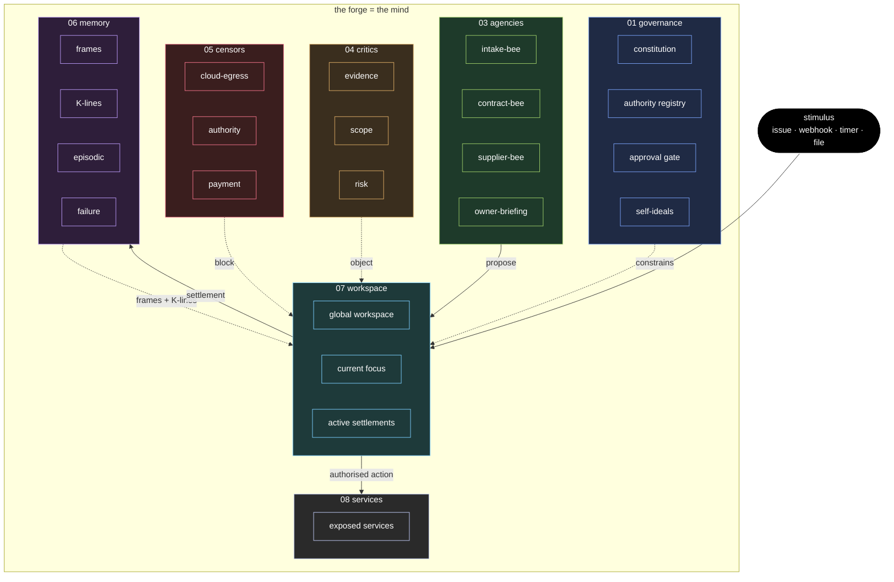
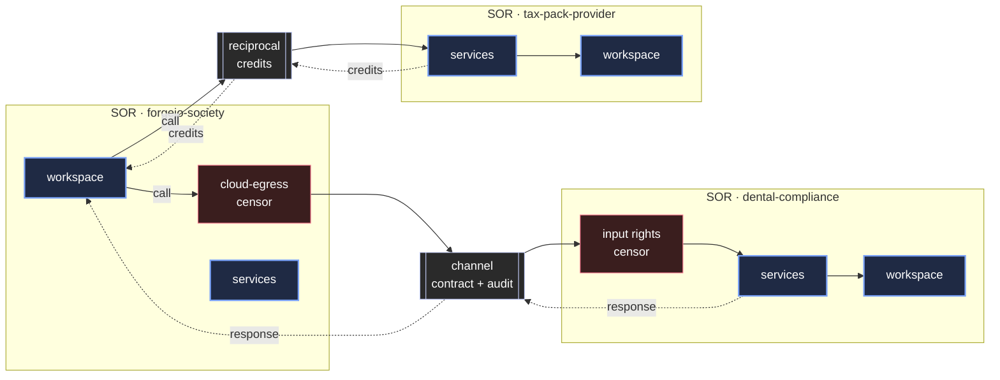

# Society Of Repo

<p align="center">
  <picture>
    
  </picture>
</p>

A complete design, scaffold, and specification for a **repo-native cognitive society** built on the principles of Marvin Minsky's *Society of Mind* and later work on multi-agent cognition.

> **The forge is the mind. The repo is an agency. The society thinks.**

---

## What is a Society of Repo?

A Society of Repo (SOR) is a Git-native, **multi-repository** architecture in which repositories become the durable cognitive organs of a living, governed AI society. It is not a single repo with many folders, and not a single agent with many tools: it is many repositories, each one a bounded organ, governed as one society under a shared constitution. Intelligence emerges from the structured interaction of many small, specialised, limited parts.

Each part has a role, and each role is its own repository:

| Part | Role |
| --- | --- |
| **Agency repos** | Do useful, bounded work |
| **Assembly repos** | Compress lower-level outputs into higher-level summaries and directives |
| **Memory repos** | Preserve and relate events, experience, patterns, frames, analogies, and concepts |
| **Critic repos** | Challenge weak proposals and shallow reasoning traces |
| **Censor repos** | Enforce hard limits |
| **Governance repos** | Define law, rights, ideals, and stability tiers |
| **Workspace repos** | Hold the society's current attention |
| **Meta-admin roles** | Observe and redesign the ecology itself |
| **Service repos** | Expose capabilities to other societies |

### Anatomy of a society



The forge itself becomes the cognitive substrate:

```text
issues         → stimuli
labels         → activation signals
commits        → memory
branches       → insulated futures and experiments
pull requests  → proposed actions
reviews        → criticism and inhibition
merges         → accepted changes to the organism
repos          → agencies and organs
the forge      → the mind
```

In a Forgejo deployment this mapping is operational, not metaphorical:

| Forgejo path or unit | SOR function |
| --- | --- |
| `.forgejo/workflows/` | Event loop and runner entrypoints |
| `.forgejo-intelligence/` | Runtime surfaces, coordinators, agents, tests, and state |
| `.forgejo-intelligence/forgejo-intelligence-ENABLED.md` | Git-tracked runtime kill switch |
| `.forgejo-intelligence/state/` | Session mappings, transcripts, schema version, and runtime reports |
| `THE-SOCIETY-OF-REPO/` | Governance, protocols, memory, agencies, critics, censors, and workspace specification |

See [02-protocols/15-forgejo-environment.md](02-protocols/15-forgejo-environment.md)
for the Forgejo runtime requirements.
See [02-protocols/16-forgejo-runtime-layers.md](02-protocols/16-forgejo-runtime-layers.md)
for the surface, coordination, and agent-engine layers and the surface
handler contract.
See [02-protocols/17-forgejo-operational-verification.md](02-protocols/17-forgejo-operational-verification.md)
for preflight, fixture, smoke, and verification cadence requirements.

---

## Theoretical basis

Society of Repo now treats the following as first-class cognitive structures:

- **frames** for situation recognition and defaults
- **K-lines** for remembered activation and inhibition patterns
- **analogy** for cross-domain fallback activation
- **representation discipline** for deciding what kind of memory an artifact is
- **insulation** for protected independence between subsystems
- **hierarchy** for compression upward and directives downward
- **credit assignment** for learning which part of the loop helped or harmed
- **introspection** for recording unknowns, blind spots, and opacity dependencies
- **relational memory** for typed graph links across all durable records
- **self-ideals** for internalised norms beyond external rules
- **ecology monitoring** for society-level self-regulation

See [00-foundations/01-society-of-mind.md](00-foundations/01-society-of-mind.md) for the full grounding.

---

## The cognitive loop

Every Society of Repo follows this recurring arc:

```text
stimulus
  → perception
  → frame selection
  → K-line and analogy activation
  → agency response
  → criticism
  → graduated inhibition
  → censorship
  → settlement
  → action
  → outcome
  → memory
  → credit assignment
  → reinforcement and evolution
```



```mermaid
flowchart LR
  classDef sense fill:#1e3a3a,stroke:#7dcfff,color:#fff
  classDef think fill:#1f2a44,stroke:#7aa2f7,color:#fff
  classDef judge fill:#3a2e1e,stroke:#e0af68,color:#fff
  classDef block fill:#3a1e1e,stroke:#f7768e,color:#fff
  classDef act   fill:#1e3a2a,stroke:#9ece6a,color:#fff
  classDef mem   fill:#2e1e3a,stroke:#bb9af7,color:#fff

  S([stimulus]):::sense --> P[perception]:::sense
  P --> F[frame selection]:::think
  F --> A[K-line + analogy<br/>activation]:::think
  A --> R[agency response]:::act
  R --> CR[criticism]:::judge
  CR --> IN[graduated inhibition]:::judge
  IN --> CN[censorship]:::block
  CN --> ST{{settlement}}:::think
  ST --> AC[action]:::act
  AC --> OU[outcome]:::act
  OU --> ME[memory]:::mem
  ME --> CA[credit assignment]:::mem
  CA --> EV[reinforcement<br/>+ evolution]:::mem
  EV -.updates.-> F
  EV -.updates.-> A
  EV -.updates.-> R
```

See [00-foundations/02-cognitive-loop.md](00-foundations/02-cognitive-loop.md) for the complete loop specification.

---

## Folder structure

```
THE-SOCIETY-OF-REPO/
├── README.md
├── 00-foundations/                 ← theory, loop, maturity, anti-patterns, skills, mind/brain/body, research crosswalk
├── 01-governance/                  ← constitution, authority, approvals, rights, policies, self-ideals
├── 02-protocols/                   ← identity, constitution, event, activation, settlement, memory,
│                                       representation, credit-assignment, introspection, insulation,
│                                       hierarchy, relational-memory, services, governance, Forgejo environment
├── 03-agencies/                    ← worker, assembly, and meta-admin roles
├── 04-critics/                     ← challenge repos: evidence, scope, cost, privacy, risk,
│                                       overconfidence, source-quality, staleness
├── 05-censors/                     ← block repos: cloud-egress, authority, payment, delegation,
│                                       credential, pii-exfiltration
├── 06-memory/                      ← events, episodic, semantic, procedural, failure, frames,
│                                       analogies, concepts, klines, decisions
├── 07-workspace/                   ← global-workspace, current-focus, settlements, briefings
├── 08-services/                    ← service repos exposed to other SORs
├── 09-channels/                    ← SOR-to-SOR service channel agreements
└── 10-evolution/                   ← reinforcement, differentiation, retirement, ecology lifecycle
```

---

## Navigation

| Section | Description |
| --- | --- |
| [00-foundations/](00-foundations/README.md) | Theory, cognitive loop, maturity, anti-patterns, skills, Mind–Brain–Body, research crosswalk, unified gap incorporation |
| [01-governance/](01-governance/README.md) | Constitution, authority registry, approval gate, rights registry, policy ledger, self-ideals |
| [02-protocols/](02-protocols/README.md) | Identity, activation, settlement, memory, representation, credit assignment, introspection, insulation, hierarchy, relational memory, Forgejo environment, Forgejo runtime layers, Forgejo operational verification |
| [03-agencies/](03-agencies/README.md) | Worker, assembly, and meta-admin roles |
| [04-critics/](04-critics/README.md) | Critic repos that challenge proposals and reasoning traces |
| [05-censors/](05-censors/README.md) | Censor repos that enforce hard limits |
| [06-memory/](06-memory/README.md) | Events, episodic, semantic, procedural, failure, frames, analogies, concepts, K-lines, decisions |
| [07-workspace/](07-workspace/README.md) | Global workspace, current focus, active settlements, owner briefings |
| [08-services/](08-services/README.md) | Services this SOR exposes to other societies |
| [09-channels/](09-channels/README.md) | SOR-to-SOR service channel agreements and reciprocal trades |
| [10-evolution/](10-evolution/README.md) | Reinforcement, differentiation, retirement, bootstrap protection, ecology review |

---

## The maturity ladder

| Level | Name | What exists |
| --- | --- | --- |
| 0 | Storage | Files in repos |
| 1 | Memory | Structured records, events, summaries |
| 2 | Agency | Repos with roles, constitutions, outputs |
| 3 | Society | Multiple repos activate, criticise, inhibit, settle, act |
| 4 | Reflective learning society | Frames, K-lines, introspection, credit assignment, differentiation, concept formation |
| 5 | Networked society | Governed channels to other SORs |
| 6 | Economic society | Metered services, rights, and reputation |

Network reach and commercial sophistication do **not** by themselves imply deeper cognition.

---

## Core principle

> A Society of Repo is not one agent, one model, or one pipeline.
> It is a governed ecology of many small useful intelligences — each limited, each inspectable, each versioned.
> The intelligence is located in the structured interaction between them, and in the society's ability to represent, remember, compare, inhibit, revise, and observe itself.

---

## Societies of societies

A mature SOR rarely lives alone. It calls and is called by other SORs through governed channels — never as raw API integrations, but as cognitive transactions with contracts, censors, and audit trails.



Each channel carries a service contract, input/output rights, pricing or reciprocal credits, privacy and retention terms, an audit trace, and a reputation feedback loop. See [02-protocols/07-service-channel.md](02-protocols/07-service-channel.md) and [09-channels/](09-channels/README.md).
