# Society of Repo

## A definition, theory, protocol, and practice for repo-native cognitive societies

> A forge-native cognitive ecology: a self-hosted, Git-versioned Society of Mind where repositories become durable cognitive organs, issues become stimuli, commits become memory, pull requests become proposed actions, and intelligence emerges from many small governed agencies rather than one monolithic AI.

---

## 1. Definition

**Society of Repo** is a repo-native, **multi-repository** architecture for building living, governed, useful AI societies out of Git repositories.

A Society of Repo is many repositories, not one. Each repository is a durable cognitive unit — an agency, memory, critic, censor, habit, regulator, workspace, service provider, or organ of thought — and the society is the governed interaction of those repositories under a shared constitution.

A Society of Repo turns the software forge into a living substrate where:

```text
issues become stimuli
labels become activation signals
commits become memory
branches become possible futures
pull requests become proposed actions
reviews become criticism and inhibition
merges become accepted changes to the organism
repos become agencies
the forge becomes the mind
```

The central claim is simple:

> **The forge is the mind. The repo is an agency. The society thinks.**

A Society of Repo is not one chatbot, one agent, one model, or one automation pipeline. It is a structured ecology of many small useful intelligences, each limited, governed, inspectable, and versioned.

---

## 2. Core theory

Society of Repo begins from the idea that intelligence does not need to live in one central agent.

Instead, useful intelligence can emerge from many partial processes:

```text
detectors
classifiers
memories
habits
critics
censors
planners
workers
reviewers
evaluators
governors
traders
```

Each part is narrow.
Each part sees only a piece.
Each part contributes a signal.

The society becomes intelligent through interaction.

A single agency may notice a deadline.
Another may recall a similar contract.
Another may object that private data cannot leave the local system.
Another may propose a draft message.
Another may block the action until a human approves it.

The result is not “the AI had an answer.”

The result is:

> **A visible settlement among competing useful agencies.**

That is the heart of Society of Repo.

---

## 3. The Society of Repo loop

Every Society of Repo follows a recurring cognitive loop.

```text
stimulus
→ perception
→ activation
→ agency response
→ criticism
→ censorship
→ settlement
→ action
→ outcome
→ memory
→ reinforcement
```



```mermaid
flowchart LR
  classDef sense fill:#1e3a3a,stroke:#7dcfff,color:#fff
  classDef think fill:#1f2a44,stroke:#7aa2f7,color:#fff
  classDef judge fill:#3a2e1e,stroke:#e0af68,color:#fff
  classDef block fill:#3a1e1e,stroke:#f7768e,color:#fff
  classDef act   fill:#1e3a2a,stroke:#9ece6a,color:#fff
  classDef mem   fill:#2e1e3a,stroke:#bb9af7,color:#fff

  S([stimulus]):::sense --> P[perception]:::sense --> AC[activation]:::think
  AC --> R[agency response]:::act --> CR[criticism]:::judge --> CN[censorship]:::block
  CN --> ST{{settlement}}:::think --> A[action]:::act --> O[outcome]:::act
  O --> M[memory]:::mem --> RF[reinforcement]:::mem
  RF -.shapes next cycle.-> AC
```

### Stimulus

Something happens.

An issue is opened.
A file is uploaded.
A contract arrives.
A bank export changes.
A staff certificate expires.
A supplier invoice increases.
A patient report appears.
A repo fails tests.
A customer complains.

### Perception

Micro-agents extract features.

```text
this is a contract
this contains a deadline
this involves payroll
this looks private
this cost is unusual
this resembles a prior event
this requires approval
```

### Activation

Relevant repos wake.

A contract repo wakes.
A tax repo wakes.
A privacy censor wakes.
A memory repo wakes.
A risk repo wakes.
A billing repo wakes.

### Agency response

Each active repo contributes something.

```text
summary
warning
obligation
question
draft
comparison
recommendation
objection
```

### Criticism

Critics challenge weak proposals.

```text
Where is the evidence?
Is this outside scope?
Is this legally sensitive?
Is the confidence too high?
Is the wording unsafe?
```

### Censorship

Censors block forbidden paths.

```text
Do not send this to cloud.
Do not act without approval.
Do not expose patient data.
Do not modify another repo.
Do not spend above budget.
```

### Settlement

The society chooses an authorised next step.

A settlement is not just a decision.
It is a visible record of how the decision formed.

### Action

The authorised executor acts.

```text
write a summary
open a task
draft a reply
create a report
prepare an accountant pack
request human approval
call another Society of Repo
```

### Memory

The outcome is recorded.

```text
what happened
what worked
what failed
what was blocked
what should happen next time
```

### Reinforcement

Useful patterns strengthen.
Bad patterns weaken.
New agencies may be proposed.
Old agencies may be retired.

---

## 4. The basic units

A Society of Repo contains several kinds of repos.

### Agency repos

These do useful work.

Examples:

```text
contract-bee
tax-bee
staff-bee
supplier-bee
finance-watch
chair-flow
issue-triage
code-review
```

### Memory repos

These preserve experience.

Examples:

```text
memory-episodes
memory-failures
memory-contracts
memory-habits
memory-klines
memory-decisions
```

### Critic repos

These challenge proposals.

Examples:

```text
evidence-critic
scope-critic
cost-critic
privacy-critic
risk-critic
overconfidence-critic
```

### Censor repos

These enforce hard boundaries.

Examples:

```text
cloud-egress-censor
authority-censor
patient-data-censor
payment-censor
delegation-depth-censor
```

### Governance repos

These define law.

Examples:

```text
constitution
authority-registry
approval-gate
rights-registry
policy-ledger
```

### Workspace repos

These hold current attention.

Examples:

```text
global-workspace
current-focus
active-settlements
owner-briefings
```

### Service repos

These expose capabilities to other societies.

Examples:

```text
tax-pack-service
contract-extraction-service
grant-writing-service
dental-compliance-service
quote-review-service
```

---

## 5. The constitution

Every durable agency should have a constitution.

A constitution defines:

```text
who the agency is
what it does
what it must not do
what it may read
what it may write
what models it may use
what data may leave the local system
what requires human approval
how it is evaluated
how it may trade with other societies
```

A simple constitution might look like this:

```yaml
id: bee-useful.contract-bee
name: Contract Bee
kind: agency
status: active

purpose:
  summary: Extract obligations, dates, risks, and questions from contracts.
  non_goals:
    - provide legal advice
    - approve contracts
    - send private documents externally without permission

authority:
  level: draft
  can_read:
    - documents/contracts
    - memory/contracts
  can_write:
    - reports/contract-obligations
    - tasks/owner-review
  requires_approval_for:
    - external_service_call
    - legal_escalation
    - sharing_contract_text

models:
  default: local
  cloud: approval_required

outputs:
  - obligation_summary
  - renewal_warning
  - owner_question_list
  - risk_flag

evaluation:
  metrics:
    - missed_obligation_rate
    - false_alarm_rate
    - owner_usefulness_score
```

The constitution prevents a useful agency from becoming a rogue assistant.

---

## 6. Memory

Society of Repo treats memory as a first-class system.

Memory is not a hidden chat log.
Memory is versioned, inspectable, correctable, and reviewable.

There are several forms of memory.

### Episodic memory

What happened.

```text
April insurance renewal arrived.
The first quote was expensive.
Owner requested comparison.
Alternative provider was cheaper.
Renewal was accepted after review.
```

### Semantic memory

What is known.

```text
The practice lease renews every July.
Supplier X usually invoices monthly.
Staff CPR certificates expire yearly.
The accountant prefers CSV exports.
```

### Procedural memory

How to do things.

```text
how to prepare BAS pack
how to onboard new staff
how to check contract renewals
how to handle supplier price increases
```

### Failure memory

What went wrong.

```text
Forgot to chase lab invoice.
Misclassified equipment lease.
Sent owner too many low-priority alerts.
Called external service with excessive context.
```

### K-lines

Remembered activation patterns.

A K-line says:

> “When this kind of thing happens, wake these agencies.”

Example:

```yaml
id: kline.supplier-price-increase

trigger:
  document_type: supplier_invoice
  price_change: above_10_percent

activates:
  - supplier-bee
  - finance-watch
  - contract-bee
  - owner-briefing
  - cost-critic

suppresses:
  - marketing-bee

reinforce_when:
  - owner_confirms_useful
  - savings_found
  - contract_renegotiated

weaken_when:
  - false_alarm
  - price_change_explained
```

K-lines are how a Society of Repo develops instincts.

---

## 7. Settlement

A settlement is a visible decision record.

It records:

```text
what happened
which agencies woke
what they proposed
what critics objected to
what censors blocked
what action was authorised
what evidence was used
what human approval was required
what memory should be updated
```

Example:

```yaml
settlement_id: settlement.contract-renewal.001
stimulus: supplier-contract-uploaded

activated:
  contract-bee: 0.94
  supplier-bee: 0.81
  finance-watch: 0.76
  privacy-censor: 0.88

proposals:
  - from: contract-bee
    proposal: Extract renewal terms and notice period.
  - from: finance-watch
    proposal: Compare new pricing against last 12 months.
  - from: supplier-bee
    proposal: Check alternative suppliers.

objections:
  - from: privacy-censor
    objection: Do not send full contract to external service.

settlement:
  action: Prepare owner briefing locally.
  approval_required: true
  cloud_allowed: false
```

Settlements make reasoning visible.

They are the difference between “AI did something” and “the society formed a traceable judgement.”

---

## 8. Society Channels

A Society of Repo can operate privately, but it can also transact with other societies.

This is the next major layer.

A **Society Channel** is a governed repo-to-repo service relationship.

One SOR may ask another SOR for help.

```text
my bee-useful SOR
→ calls
specialist tax-pack SOR
```

or:

```text
farm SOR
→ calls
chemical compliance SOR
```

or:

```text
dental practice SOR
→ calls
HR policy SOR
```

The unit of exchange is not just an API call.

It is a governed cognitive transaction.

A Society Channel includes:

```text
service contract
input rights
output rights
price
reciprocal credits
privacy terms
retention terms
audit trace
confidence score
dispute window
reputation update
```

---

## 9. The Society Service Contract

A Society of Repo may publish services.

Example:

```yaml
service_id: sor.service.contract-obligation-extraction.v1
provider: bee-useful.contract-specialist
name: Contract Obligation Extraction

description:
  Extracts dates, obligations, renewal terms, risks, and owner questions from business contracts.

inputs:
  accepted:
    - contract_pdf
    - supplier_name
    - business_context
  forbidden:
    - raw patient data
    - bank credentials
    - tax file numbers

outputs:
  - obligation_summary
  - deadline_list
  - risk_flags
  - questions_for_owner
  - evidence_trace

pricing:
  mode: per_document
  amount: 8.00
  currency: AUD

rights:
  buyer_receives:
    - internal_use
    - audit_trace
    - correction_right
  provider_may_retain:
    - anonymised performance metrics
  provider_may_not_retain:
    - raw contract
    - identifiable business data

privacy:
  cloud_use: prohibited_unless_explicitly_approved
  retention_days: 0
  deletion_attestation_required: true

reputation:
  public_metrics:
    - completion_rate
    - dispute_rate
    - policy_violation_count
    - average_buyer_rating
```

This turns useful cognition into a tradable, inspectable service.

---

## 10. Reciprocal rights

Not all SOR transactions need money.

Societies may trade capability.

Example:

```yaml
reciprocal_agreement:
  parties:
    - bee-useful.eric
    - dental-compliance.sor

grant:
  bee-useful.eric_receives:
    service: dental-compliance-check.v1
    credits: 100

  dental-compliance.sor_receives:
    service: contract-obligation-extraction.v1
    credits: 100

rules:
  transferable: false
  expires: 2026-12-31
  revocable_for_policy_breach: true
  audit_required: true
```

This creates an economy of useful societies.

A small SOR can become stronger by calling trusted specialist SORs.
A strong SOR can earn revenue by exposing measured services.
Two SORs can barter.
A network of SORs can become an ecosystem.

---

## 11. Protocols

A mature Society of Repo needs explicit protocols.

### Identity Protocol

Every society, repo, agency, service, and transaction needs a stable identity.

```text
sor.bee-useful.eric
agency.contract-bee
critic.evidence
censor.cloud-egress
service.tax-pack-review.v1
transaction.tx_2026_001
```

### Constitution Protocol

Every durable agency must declare:

```text
purpose
scope
authority
privacy
models
outputs
evaluation
rights
```

### Event Protocol

Every meaningful action emits an event.

```yaml
event:
  type: document.ingested
  id: evt_001
  source: intake-bee
  timestamp: 2026-05-06T09:00:00Z
  payload:
    document_type: supplier_invoice
    classification_confidence: 0.91
```

### Activation Protocol

Stimuli activate agencies according to features and K-lines.

```yaml
activation:
  stimulus: invoice-uploaded
  features:
    supplier_invoice: 0.96
    price_change: 0.78
    recurring_vendor: 0.84
  activated:
    - supplier-bee
    - finance-watch
    - cost-critic
```

### Settlement Protocol

No nontrivial action occurs without settlement.

```text
proposal
→ criticism
→ censorship
→ authorisation
→ action
→ memory update
```

### Memory Protocol

Outcomes update memory.

```text
reinforce useful K-lines
weaken false patterns
archive stale records
preserve audit history
```

### Service Channel Protocol

SOR-to-SOR transactions require:

```text
service discovery
contract agreement
rights grant
execution
artifact return
payment or credit
evaluation
reputation update
```

### Governance Protocol

Some actions always require approval.

```text
authority increase
cloud egress
payment above limit
external service call
production action
sensitive data sharing
constitutional change
```

---

## 12. Best practices

### 1. Start local

A Society of Repo should begin as a private local system.

Local first means:

```text
local files
local forge
local models where possible
local memory
local governance
cloud only by policy
```

This creates trust.

### 2. Make agencies small

Do not build one giant all-knowing repo.

Build many small useful agencies.

Good:

```text
contract-renewal-bee
invoice-duplicate-bee
staff-expiry-bee
owner-briefing-bee
```

Bad:

```text
everything-assistant
general-business-genius
master-agent
```

Small agencies are easier to audit, improve, sell, retire, and trust.

### 3. Separate critics from workers

A worker proposes.
A critic challenges.
A censor blocks.

Do not merge these roles too early.

The system becomes safer and smarter when objection is structural.

### 4. Preserve trace

Every important action should answer:

```text
Why did this happen?
Who proposed it?
Who objected?
What was blocked?
Who approved it?
What changed afterward?
```

No trace, no trust.

### 5. Treat cloud intelligence as expensive attention

Cloud models may be useful, but they should not be the default mind.

Use cloud when:

```text
the task is hard
the value is high
the data is allowed
the cost is justified
the action is traced
```

### 6. Facts and inferences must be separate

A fact:

```text
The lease renewal date is 1 July.
```

An inference:

```text
The owner should renegotiate before renewal.
```

A proposal:

```text
Create a task to compare alternative leases.
```

A Society of Repo should not blur these.

### 7. Memory should decay, not disappear

Old memory should become colder unless reinforced.

```text
hot
warm
cold
archived
```

Deletion should be rare.
Reduced activation is safer.

### 8. Human approval is a strength

Humans are not a failure mode.
Humans are constitutional anchors.

Humans should approve:

```text
high-risk action
money movement
external disclosure
legal decisions
clinical decisions
authority changes
major business commitments
```

### 9. Sell services, not mystique

A SOR service should be measurable.

Do not sell:

```text
an intelligent agent
```

Sell:

```text
contract obligation extraction
EOFY accountant pack review
staff compliance checklist
supplier price trend detection
grant application preparation
```

Useful services win.

### 10. Retire aggressively

A living society must prune.

Retire or merge agencies that are:

```text
stale
duplicative
unreliable
too noisy
outside scope
rarely useful
```

Preserve lineage, but reduce clutter.

---

## 13. Anti-patterns

Avoid these.

### The monarch agent

One agent controls everything.

This destroys the society.

### The prompt swamp

Hundreds of vague prompts with no constitution, metrics, or trace.

### Memory hoarding

Keeping everything equally active.

This creates noise.

### Cloud leakage

Sending sensitive context externally because it is convenient.

### No settlement

Letting agencies act directly without recorded decision structure.

### No pricing discipline

External SOR calls without budgets, metering, or rights.

### No retirement

Every bee lives forever, even useless ones.

### Fake autonomy

Pretending the system can make legal, clinical, financial, or employment decisions without human authority.

---

## 14. The SOR maturity model

### Level 0 — Repo as storage

Files are stored in repos.

### Level 1 — Repo as memory

Repos hold structured records, events, and summaries.

### Level 2 — Repo as agency

Repos have roles, constitutions, and outputs.

### Level 3 — Society

Multiple repos activate, criticise, inhibit, settle, and act.

### Level 4 — Learning society

The society reinforces habits, updates K-lines, evaluates agencies, and retires weak parts.

### Level 5 — Networked society

The SOR can call other SORs through governed Society Channels.

### Level 6 — Economic society

The SOR can sell services, meter usage, grant reciprocal rights, build reputation, and participate in a market of useful cognitive societies.

---

## 15. The beautiful essence

A Society of Repo is a way to make intelligence live where responsibility already lives.

Businesses already live in documents.
Developers already live in repos.
Families already live in records.
Organisations already live in obligations.
Memory already lives in traces.

Society of Repo gives those traces agency.

It makes dead files wake up.

It makes forgotten promises speak.

It makes scattered documents organise themselves into useful memory.

It makes small businesses less dependent on one person remembering everything.

It makes AI inspectable rather than magical.

It turns useful cognition into something that can be owned, governed, improved, exchanged, and trusted.

---

## 16. Final definition

**Society of Repo** is a Git-native architecture for creating governed cognitive societies from repositories. Each repo acts as an agency, memory, critic, censor, workspace, regulator, or service provider. Societies respond to stimuli through activation, conflict, settlement, action, and reinforcement. They preserve thought as versioned memory, enforce safety through explicit governance, and may exchange capabilities with other societies through measured, rights-aware repo-to-repo service channels.

In its simplest form, it helps one person or organisation remember and act.

In its mature form, it becomes:

> **an economy of useful, versioned, local-first minds.**
